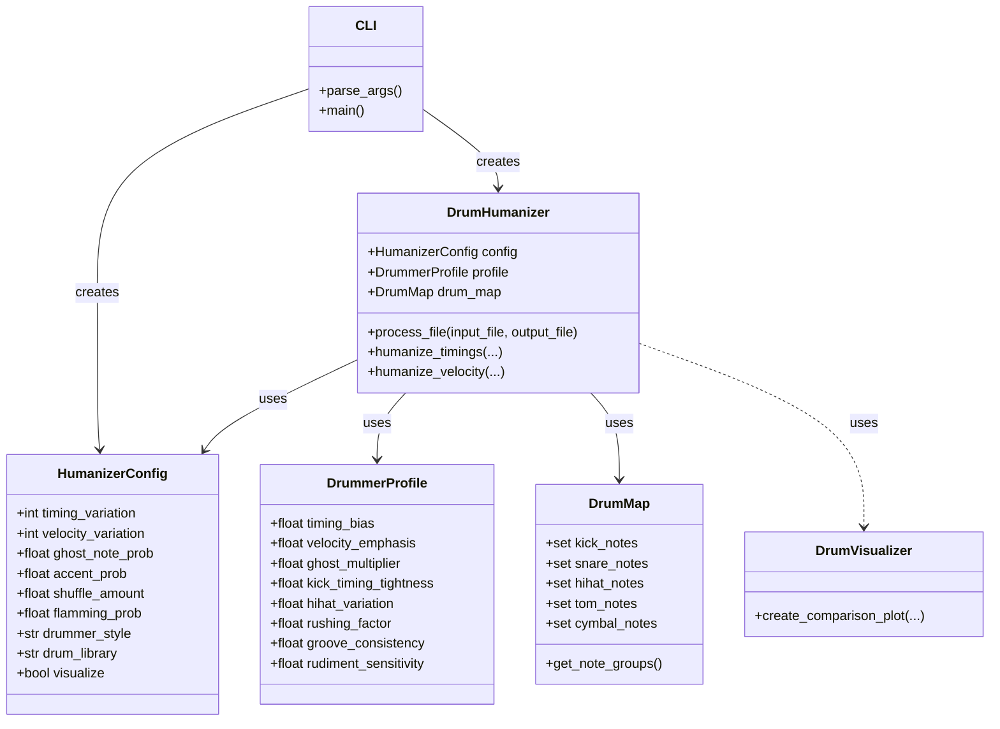

# MIDI Drum Humanizer

A Python tool to add a human feel to MIDI drum tracks.

This script takes a quantized, robotic-sounding MIDI drum track and applies subtle (or not-so-subtle) variations to the timing and velocity of the notes to simulate the natural imperfections and groove of a human drummer.

## Features

- **Timing Variation**: Shifts the timing of each drum hit to create a more natural, less rigid feel.
- **Velocity Variation**: Adjusts the velocity of each note to add dynamics and expression.
- **Drummer Profiles**: Emulates different drumming styles (e.g., "balanced", "tight", "loose") with unique rhythmic characteristics.
- **Advanced Rhythmic Nuances**:
  - **Ghost Notes**: Automatically adds low-velocity ghost notes, especially on the snare.
  - **Accents**: Adds emphasis to certain notes.
  - **Flams**: Creates realistic flam strokes on the snare.
  - **Shuffle/Swing**: Applies a shuffle or swing feel to the groove.
- **Instrument-Specific Logic**: Applies different humanization rules to different parts of the drum kit for a more authentic sound.
- **Rudiment Detection**: Identifies common drumming patterns (rudiments) and applies specialized humanization to them.
- **Drum Library Support**: Can be configured for different drum sound libraries (e.g., General MIDI, Addictive Drums 2, Superior Drummer 3).
- **Visualization**: Generates a PNG image that visually compares the original and humanized MIDI patterns, showing the changes in timing and velocity.

## Installation

1.  **Clone the repository:**
    ```bash
    git clone https://github.com/Hamsterdamm/drums_midi_humanizer.git
    cd drums_midi_humanizer
    ```

2.  **Install uv (if not already installed):**
    ```bash
    # On macOS/Linux
    curl -LsSf https://astral.sh/uv/install.sh | sh
    
    # On Windows
    powershell -ExecutionPolicy ByPass -c "irm https://astral.sh/uv/install.ps1 | iex"
    ```

3.  **Sync the environment:**
    ```bash
    uv sync
    ```
    *(This automatically creates a `.venv` locked to the project dependencies.)*

## Usage

The script is run from the command line using `uv run`.

### Basic Usage

To humanize a MIDI file with the default "balanced" drummer style:

```bash
uv run humanize-drums.py "path/to/your/drum-track.mid"
```

This will create a new file named `drum-track_humanized.mid` in the same directory.

### Advanced Usage

You can customize the humanization with various command-line arguments:

```bash
uv run humanize-drums.py "input.mid" -o "output.mid" --style tight --timing 8 --velocity 20 --visualize
```

### Command-Line Options

-   `input_file`: (Required) The path to the input MIDI file.
-   `-o, --output`: The path for the output MIDI file. (Default: `[input_file]_humanized.mid`)
-   `-t, --timing`: The amount of timing variation in MIDI ticks. (Default: 10)
-   `-v, --velocity`: The amount of velocity variation. (Default: 15)
-   `-g, --ghost`: The probability of generating a ghost note (0.0 to 1.0). (Default: 0.1)
-   `-a, --accent`: The probability of accenting a note (0.0 to 1.0). (Default: 0.2)
-   `-s, --shuffle`: The amount of shuffle/swing to apply (0.0 to 0.5). (Default: 0.0)
-   `-f, --flams`: The probability of adding a flam to a snare hit (0.0 to 1.0). (Default: 0.0)
-   `--style`: The drummer style profile to use. Available styles: `balanced`, `jazzy`, `rock`, `precise`, `loose`, `modern_metal`. (Default: `balanced`)
-   `--library`: The drum library mapping to use. (Default: `gm`)
-   `--visualize`: Generate a PNG image comparing the original and humanized MIDI.

### Examples

**1. Applying a "tight" and precise feel:**

```bash
uv run humanize-drums.py "my_song_drums.mid" --style tight --timing 5
```

**2. Creating a "loose" and "lazy" groove with some swing:**

```bash
uv run humanize-drums.py "jazz_drums.mid" --style lazy --shuffle 0.3
```

**3. Humanizing a track and generating a visualization:**

```bash
uv run humanize-drums.py "rock_beat.mid" -o "rock_beat_human.mid" --style powerful --visualize
```

This will create `rock_beat_human.mid` and `rock_beat_human.png`.

## How It Works

The script parses the input MIDI file and iterates through the drum notes. For each note, it applies a series of transformations based on the selected drummer profile and other parameters. It then reconstructs the MIDI track with the new, humanized timing and velocity information, ensuring that all other MIDI messages (like tempo changes) are preserved.

## Project Architecture

The following UML diagram describes the relationships between the core entities in the project:



## Contributing

Contributions are welcome! If you have ideas for new features, drummer profiles, or improvements, feel free to open an issue or submit a pull request.
