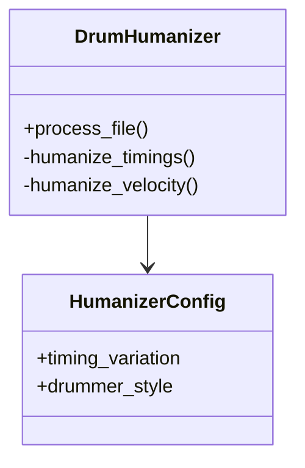

# Project Review & Roadmap

## Current Status
**Maturity Level:** Beta / In-Refactor
**Code Quality:** High (Style/Structure), Mixed (Integration/Logic/Robustness)

The project demonstrates a solid architectural foundation with separation of concerns (CLI, Core, Config, Viz). Several critical issues have been recently resolved including logging, exception handling, and note duration preservation. However, the integration of advanced humanization logic (rudiments) remains incomplete, and the application still relies on certain hardcoded assumptions regarding MIDI metadata (tempo/time signature).

## Critical Issues (Bugs & Logic Gaps)

### 1. Logic Disconnects
- ~~**Rudiment Detection Unused (High)**: `detect_rudiment_pattern` is defined in `utils/midi.py` but never utilized directly in the main `process_file` loops.~~ **(Resolved)**

### 2. MIDI & Music Theory Limitations
- **Time Signature Assumptions (Medium)**: Hardcoded `self.time_sig_numerator = 4`. `time_signature` meta-messages exist but are not tracked to dynamically alter logic for 3/4, 6/8, etc.
- **Tempo Changes Ignored (Medium)**: The script does not dynamically assess its timings based on shifting tempos through the track.

## Code Quality Observations

- **Strengths**:
    - **Type Hinting**: Excellent usage throughout `src`.
    - **Configuration**: Explicit `HumanizerConfig` dataclass and CLI argument parsing performs robust validation.
    - **Modular Design**: Clear separation between core logic, utils, and CLI.
    - **Stability**: Both division by zero and file-loading crashes have been resolved with graceful error handling and constraints.
    - **Logging**: Python's native `logging` module is properly implemented, replacing verbose `print` statements.

- **Weaknesses**:
    - **Redundant Logic**: Ad-hoc random seed resets (`random.seed(None)`) found in code, instead of an isolated PRNG.
    - **Memory Efficiency**: Loads all notes into memory within the humanization track list; could be problematic for massive MIDI files.

## TODO Roadmap

### Phase 1: Stability & Core Logic Fixes
- [x] **Fix Division by Zero**: Add checks in fill analysis for zero-duration fills.
- [x] **Exception Handling**: Wrap file operations in `try/except` blocks with user-friendly error messages.
- [x] **Validate Inputs**: Ensure inputs like `drummer_style` and probabilities are validated via CLI choices and config data.
- [x] **Integrate Rudiments**: Call `detect_rudiment_pattern` within `process_file` to affect humanizer outcomes.

### Phase 2: MIDI Fidelity
- [ ] **Dynamic Time Signatures**: Parse `time_signature` events and update `time_sig_numerator` dynamically.
- [x] **Preserve Metadata**: Channel logic is mapped correctly and non-note-events are successfully passed into the output.
- [x] **Note Durations**: `note_off` and `note_on` messages are successfully paired, maintaining original note durations on rewrite.

### Phase 3: Refactoring & Enhancements
- [x] **Desktop GUI**: Built a fully interactive `tkinter` application with a responsive, synchronized 5-plot playback and visualizer via `matplotlib`.
- [x] **Logging**: Replace `print` statements with Python's `logging` module.
- [ ] **Reproducibility**: Centralize RNG seeding (remove redundant resets) and expose master seed in Config.
- [ ] **Optimization**: Investigate generator-based processing for large files.

## Entity Relationship Diagram (Current)

