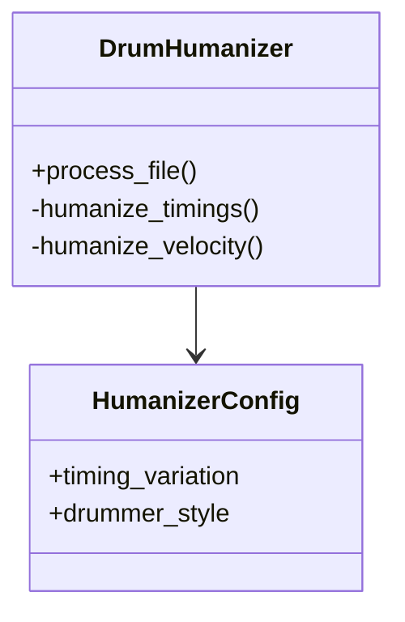

# Project Review & Roadmap

## Current Status
**Maturity Level:** Beta / In-Refactor
**Code Quality:** High (Style/Structure), Mixed (Integration/Logic/Robustness)

The project demonstrates a solid architectural foundation with separation of concerns (CLI, Core, Config, Viz). Several critical issues have been recently resolved including logging, exception handling, note duration preservation, and rudiment pattern integration. Furthermore, the core processing engine now dynamically handles shifting tempos and varying time signatures, ensuring realistic humanization across complex song structures.

## Critical Issues (Bugs & Logic Gaps)

### 1. Logic Disconnects
- ~~**Rudiment Detection Unused (High)**: `detect_rudiment_pattern` is defined in `utils/midi.py` but never utilized directly in the main `process_file` loops.~~ **(Resolved)**

### 2. MIDI & Music Theory Limitations
- ~~**Time Signature Assumptions (Medium)**: Hardcoded `self.time_sig_numerator = 4`. `time_signature` meta-messages exist but are not tracked to dynamically alter logic for 3/4, 6/8, etc.~~ **(Resolved)**
- ~~**Tempo Changes Ignored (Medium)**: The script does not dynamically assess its timings based on shifting tempos through the track.~~ **(Resolved)**

## Areas for Fine-Tuning

- **Crash/Kick Alignment:** The application applies independent timing variations to the kick and cymbals. Cymbals on the downbeat have extreme variation logic applied to them (`var -= 2 + self.profile.rushing_factor * 3`). If the kick is clamped tightly to the downbeat but the crash cymbal drifts too far, it will create an awkward "flam" effect. A drummer hitting a crash on beat 1 almost always anchors it perfectly to the kick drum. *Tuning suggestion: If a crash and kick occur on the exact same tick, force their timing offset to be identical.*
- **Shuffle Logic:** The script currently creates shuffle by delaying offbeat eighth notes (`measure_position * 8`). Many grooves (like half-time shuffles or hip-hop swing) rely on delaying the *sixteenth* notes, not just the eighths. Expanding the `_is_offbeat_eighth` logic to handle 16th-note swing would broaden the application's stylistic range.

## Missing Musical Nuances

- ~~**Ride Cymbal Groove Logic:** The `DrumMap` groups rides and crashes into a single `cymbal_notes` set. However, the Ride cymbal is often used as a timekeeper (like the hi-hat) rather than an accent (like the crash). It is missing the micro-timing and subdivision velocity logic that is currently applied to the hi-hats.~~ **(Resolved)**
- **Left/Right Hand Tracking (Sticking):** The application modifies velocities if a pattern matches a rudiment, but it does not track overall "hand availability." If a MIDI file has a fast 16th-note hi-hat pattern and simultaneous 16th-note snare ghost notes, a human with two arms physically cannot play it without crossing over or dropping notes.
- **Song Structure Awareness (Macro-dynamics):** Drummers play differently depending on the song section. They naturally play slightly ahead of the beat and louder during a chorus, and pull back the tempo and velocity during a verse. The application currently applies a static profile across the entire file.
- **Open/Closed Hi-Hat Interactions:** Based on observed physics, hitting an open hi-hat immediately before a pedal-close (choke) changes how the stick strikes the metal. Adding a rule that slightly reduces the velocity or alters the timing of an open hi-hat if a closed hi-hat follows within an 8th note would add realism to funk and disco grooves.

## Code Quality Observations

- **Strengths**:
    - **Type Hinting**: Excellent usage throughout `src`.
    - **Configuration**: Explicit `HumanizerConfig` dataclass and CLI argument parsing performs robust validation.
    - **Modular Design**: Clear separation between core logic, utils, and CLI.
    - **Stability**: Both division by zero and file-loading crashes have been resolved with graceful error handling and constraints.
    - **Logging**: Python's native `logging` module is properly implemented, replacing verbose `print` statements.

- **Weaknesses**:
    - **Redundant Logic**: Ad-hoc random seed resets (`random.seed(None)`) found in code, instead of an isolated PRNG.
    - **Memory Efficiency**: Loads all notes into memory within the humanization track list; could be problematic for massive MIDI files.

## TODO Roadmap

### Phase 1: Stability & Core Logic Fixes
- [x] **Fix Division by Zero**: Add checks in fill analysis for zero-duration fills.
- [x] **Exception Handling**: Wrap file operations in `try/except` blocks with user-friendly error messages.
- [x] **Validate Inputs**: Ensure inputs like `drummer_style` and probabilities are validated via CLI choices and config data.
- [x] **Integrate Rudiments**: Call `detect_rudiment_pattern` within `process_file` to affect humanizer outcomes.

### Phase 2: MIDI Fidelity
- [x] **Dynamic Time Signatures & Tempo**: Parse `time_signature` and `set_tempo` events and dynamically calculate measure positions via `MidiTimeline`.
- [x] **Preserve Metadata**: Channel logic is mapped correctly and non-note-events are successfully passed into the output.
- [x] **Note Durations**: `note_off` and `note_on` messages are successfully paired, maintaining original note durations on rewrite.

### Phase 3: Refactoring & Enhancements
- [x] **Desktop GUI**: Built a fully interactive `tkinter` application with a responsive, synchronized 5-plot playback and visualizer via `matplotlib`.
- [x] **Logging**: Replace `print` statements with Python's `logging` module.
- [ ] **Reproducibility**: Centralize RNG seeding (remove redundant resets) and expose master seed in Config.
- [ ] **Optimization**: Investigate generator-based processing for large files.

### Phase 4: Advanced Theory & Nuances
- [ ] **Crash/Kick Alignment**: Bind cymbal/kick timings on downbeats.
- [ ] **16th-Note Swing**: Expand shuffle logic beyond 8th notes.
- [x] **Ride Cymbal Logic**: Separate ride from crashes and apply timekeeping logic.
- [ ] **Hand Tracking System**: Sticking analysis to prevent physically impossible drum overlaps.
- [ ] **Macro-Dynamics**: Dynamic profiles based on track density/song structure.
- [ ] **Hi-Hat Choke Physics**: Implement realistic interaction between open and closed strokes.

## Entity Relationship Diagram (Current)

