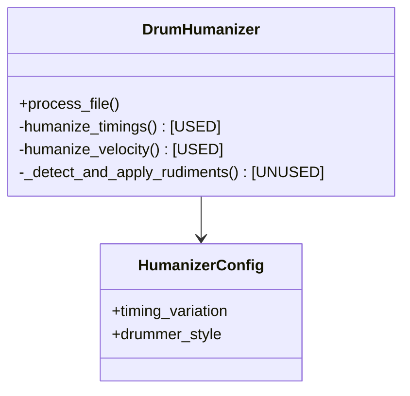

# Project Review & Roadmap

## Current Status
**Maturity Level:** Beta / In-Refactor
**Code Quality:** High (Style/Structure), Mixed (Integration/Logic/Robustness)

The project demonstrates a solid architectural foundation with separation of concerns (CLI, Core, Config, Viz). However, the integration of advanced humanization logic (rudiments) is incomplete, and the application lacks robustness regarding file I/O, MIDI metadata (tempo/time signature), and edge cases (division by zero).

## Critical Issues (Bugs & Logic Gaps)

### 1. Logic Disconnects
- **Rudiment Detection Unused (High)**: `_detect_and_apply_rudiments` is defined but never called in the main processing loop.
- **Empty Groove Patterns (Medium)**: If no repeating patterns are found, `groove_patterns` is empty, potentially causing logic errors in `is_pattern_point`.

### 2. MIDI & Music Theory Limitations
- **Time Signature Assumptions (Medium)**: Hardcoded to 4/4. `time_signature` meta-messages are ignored, breaking logic for 3/4, 6/8, etc.
- **Tempo Changes Ignored (Medium)**: The script does not account for tempo changes, which is critical if absolute time calculations are ever needed.
- **Channel Handling (Low)**: MIDI channel information is not preserved or validated; output defaults to channel 0 or copies blindly without checks.
- **Note Off/Duration (Low)**: New notes are created with a fixed length (often 1 tick), ignoring the original duration or musical context.

### 3. Runtime Stability
- **Division by Zero (High)**: In fill analysis, `fill_end - fill_start` can be zero, causing a crash.
- **Exception Handling (Medium)**: Lack of `try/except` blocks for file I/O (loading/saving MIDI).
- **Input Validation (Low)**: Drummer styles are not validated before access.

## Code Quality Observations

- **Strengths**:
    - **Type Hinting**: Excellent usage throughout `src`.
    - **Configuration**: `HumanizerConfig` dataclass is clean.
    - **Modular Design**: Clear separation between core logic and CLI.

- **Weaknesses**:
    - **Redundant Logic**: Multiple `random.seed()` resets found in code.
    - **Memory Efficiency**: Loads all notes into memory; could be problematic for massive MIDI files.
    - **Logging**: Relies on `print` statements instead of the `logging` module.

## TODO Roadmap

### Phase 1: Stability & Core Logic Fixes
- [ ] **Fix Division by Zero**: Add checks in fill analysis for zero-duration fills.
- [ ] **Exception Handling**: Wrap file operations in `try/except` blocks with user-friendly error messages.
- [ ] **Validate Inputs**: Ensure `drummer_style` exists in config before processing.
- [ ] **Integrate Rudiments**: Call `_detect_and_apply_rudiments` within `process_file`.

### Phase 2: MIDI Fidelity
- [ ] **Dynamic Time Signatures**: Parse `time_signature` events and update `time_sig_numerator` dynamically.
- [ ] **Preserve Metadata**: Ensure Track Name, Tempo, Copyright, and Channel info are preserved in the output.
- [ ] **Note Durations**: Preserve original note durations or implement a smart duration logic (e.g., 1/16th default).

### Phase 3: Refactoring & Enhancements
- [ ] **Logging**: Replace `print` statements with Python's `logging` module.
- [ ] **Reproducibility**: Centralize RNG seeding (remove redundant resets) and expose seed in Config.
- [ ] **Optimization**: Investigate generator-based processing for large files.

## Entity Relationship Diagram (Current)

