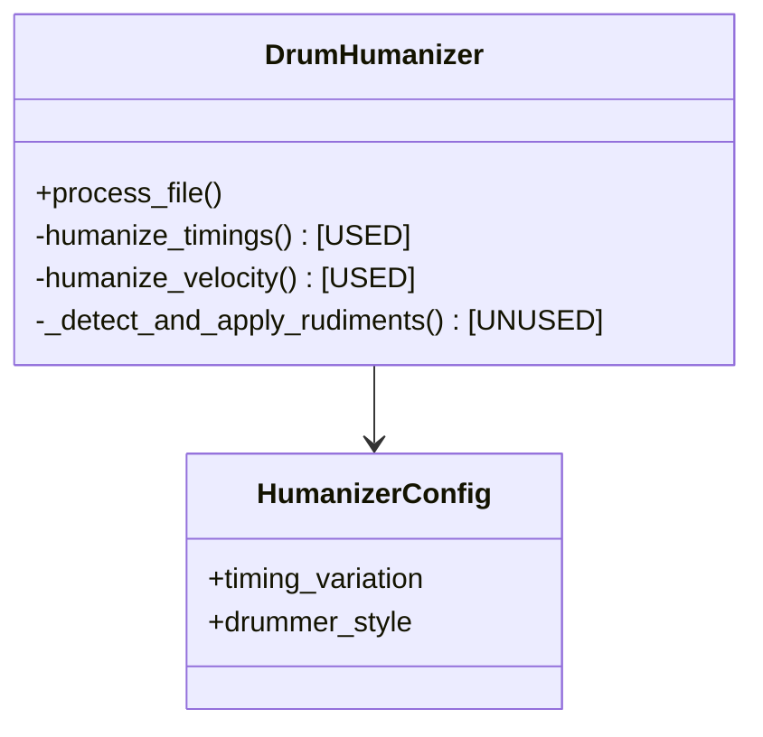

# Project Review & Roadmap

## Current Status
**Maturity Level:** Beta / In-Refactor
**Code Quality:** High (Style/Structure), Low (Integration/Logic)

The project has a professional structure and good test coverage, but the core "humanization" engine is currently using simplified logic, leaving the advanced features (rudiments, fills, complex grooves) implemented but disconnected.

## Critical Issues (Bugs & Logic Gaps)

### 1. Rudiment Detection is Unused
**Severity:** High
- **Issue:** `_detect_and_apply_rudiments` is defined but never called.
- **Impact:** Rudiment patterns are not applied.

### 2. Time Signature Handling
**Severity:** Medium
- **Issue:** `DrumHumanizer` hardcodes `time_sig_numerator` to 4. It ignores `time_signature` events in the source MIDI.
- **Impact:** Measure position calculations (`_get_measure_position`) are wrong for any track not in 4/4 time (e.g., waltzes, 6/8).

### 3. Note Off Handling
**Severity:** Low
- **Issue:** New notes are created with a fixed length of 1 tick.
- **Impact:** May look messy in DAWs or be cut off by some samplers.

## Code Quality Observations

- **Type Hinting:** Excellent usage throughout the `src` directory.
- **Testing:** Good coverage, though tests likely pass because they test the *components* individually, not the full integration of advanced logic in `process_file`.
- **Configuration:** `HumanizerConfig` is well-structured using dataclasses.

## TODO Roadmap

### Phase 1: Integration (Fixing the Logic)
- [ ] **Implement Rudiments**: Integrate `detect_rudiment_pattern` and pass pattern data to `humanize_timings`.

### Phase 2: MIDI Metadata Support
- [ ] **Read Time Signature**:
    - [ ] Scan track for `time_signature` meta-messages.
    - [ ] Update `self.time_sig_numerator` dynamically during processing or map changes over time.
- [ ] **Preserve Non-Note Data**: Ensure all meta-events (track name, tempo, copyright) are preserved exactly.

### Phase 3: Enhancements
- [ ] **Reproducibility**: Add a `seed` argument to `HumanizerConfig` and initialize `random.seed()` at the start of processing.
- [ ] **Note Duration**: Calculate original note duration and preserve it, or use a sensible default (e.g., 1/16th note) instead of 1 tick.
- [ ] **Logging**: Replace `print` statements with Python's `logging` module.

## Entity Relationship Diagram (Current)

